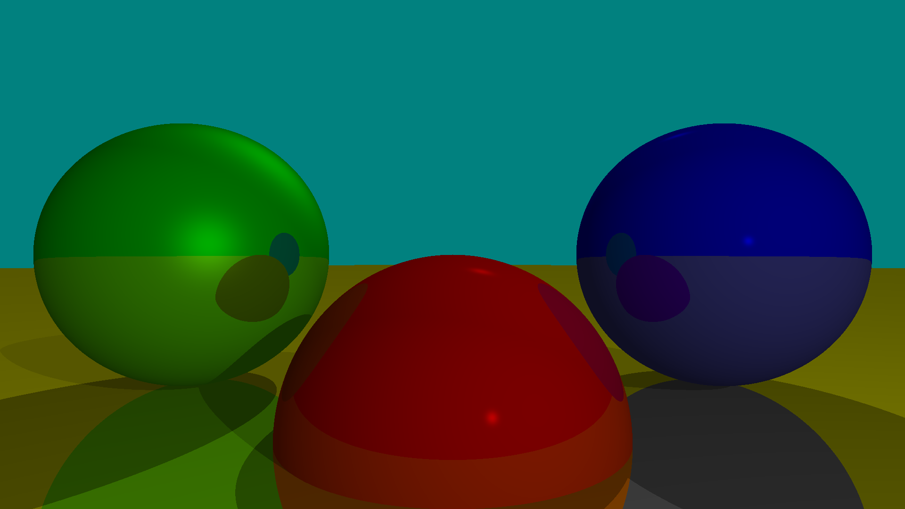

# Simple Raytracer

A small simple software ray tracer written in C++, can draw spheres with varying reflectivity and shinyness, with shadows for different light sources. Outputs the image as a .tga file.

Tried to use modern C++ features when possible. Scene information, image size, etc is hardcoded in main.cpp.

## To Build On Linux
Can just run `make` in the root folder and run the resulting binary with `./raytracer`

## References

[Computer Graphics From Scratch by Gabriel Gambetta](https://gabrielgambetta.com/computer-graphics-from-scratch/) - Read the first part of the book on raytracing to build this raytracer.